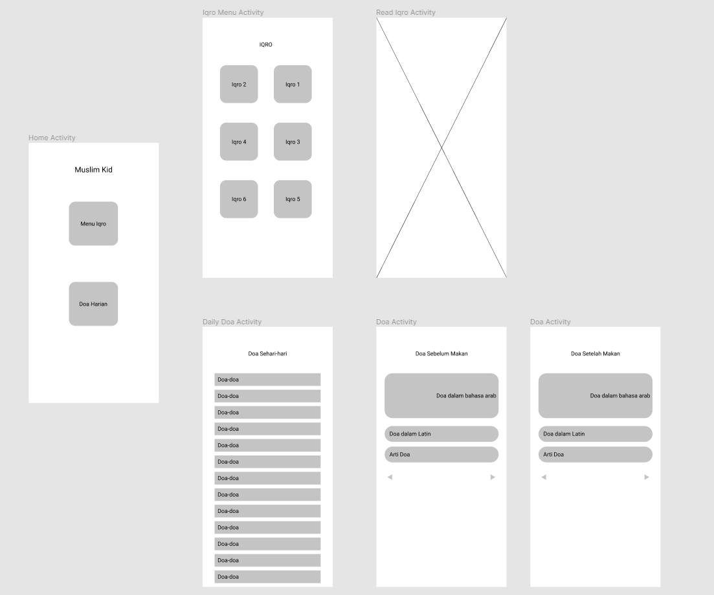

# Project Muslim Kid.

This app will let user can read iqra from their own phone. Iqro is a textbook used in Indonesia and Malaysia for learning Arabic letters and pronunciation. Not only Iqro, in this application there are also daily doa. 

### Target Segment
Children who are learning to read Qur'an and memorize the daily doa.

### Advance Topic
The advance topic that I apply is rest api to retrieve daily doa data. and webview to display iqra pdf. 

### Features
- User can read iqro from iqro-1 to iqro-6
- User can see list daily doa.
- User can read doa in arabic and latin latters and also translation in Indonesian.

### Wireframe

https://www.figma.com/file/nDv9YkfNq5ox9vFyHsm8uL/Muslim-Kid?node-id=0%3A1