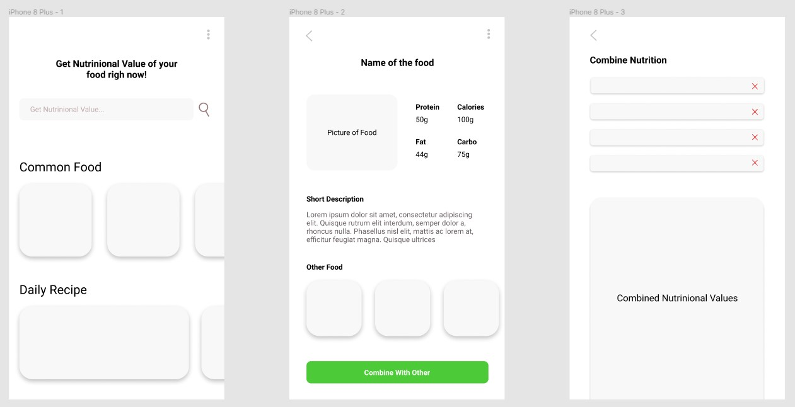

# NuGo

NuGo is an app where users can find nutritional values of food they are eating. This way, users can know a little bit more about their food and be at ease. This app will be a great help for everyone in general, and those who are on a diet and wanted to carefully choose their food.

## Target Segment

-  User in general
-  User who are on a diet

## Features

-  **Food Nutrition Finder**, where users can find about nutritional values of food. User can also do a multiple input search
-  **Calorie Calculator**, make a calculation about users recommended calorie intake in a day based on height, weight, age, and activity
-  **Daily Recipe**, a list of healty daily recipe food

## Data Source

The nutritional data will be fetch from [edamam nutritional api](https://developer.edamam.com/edamam-nutrition-api). They have a free plan, but with some limitations.

## Initial Wireframe

https://www.figma.com/proto/CdVNpjfOALGLMkOsAw6Pur/Nutrition-App?node-id=1%3A3&scaling=scale-down&page-id=0%3A1
