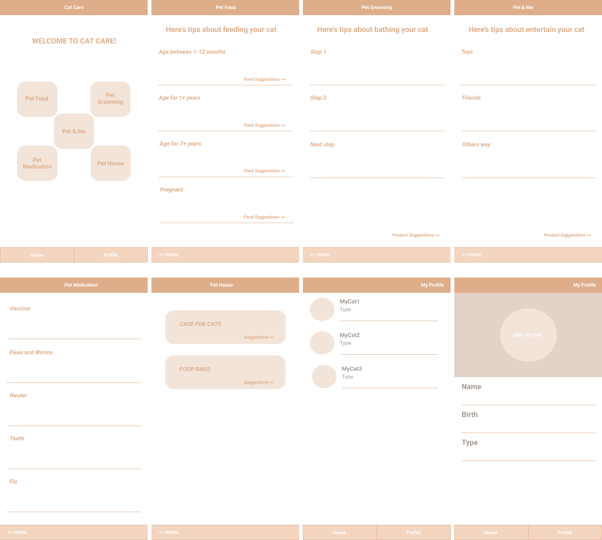

# Cat Care
Cat Care is an application for someone who has a cat and wants to find out how to take care of their cat on a daily basis so that their cat grows well and healthy.
This application will show suggestions for appropriate food according to the age of the cat, how to bathe their pet according to the type of cat,
and some other treatments that need to be done for the good of their cat.

## Target Segment
- User who are new cat owners
- User who needs information about cat care

## Features of the App
- User can see each information from 5 topics of Cat Care
- User can make a list of their cats

## Advanced Topic
- Firebase (This app will be using Firebase to register new user and allow user to log in to the app)

## Initial Wireframe of the App

https://www.figma.com/file/77CjxqOUK2b4ZRQ3hKIE2W/Cat-Care?node-id=0%3A1
