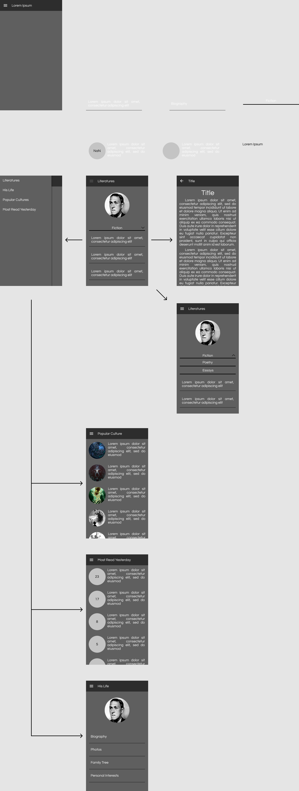

# Lovecraft Archive

I wish to create an app using Flutter where users can read most of Lovecraft's archived "cosmic horror" literatures.

This project uses Flutter.

# Target Users

- Bookworms in general.
- Lovecraft enthusiasts.
- Fans of the cosmic horror genre.

# Advanced Topic

- Webview

# Features

- An archive of Lovecraft's literatures.
- Anonymized read counter.
- Table of "top 5 most read yesterday".
- Webview to various fanworks and/or topics related to the "cosmic horror" genre (verified only).

# "Copyright Issue"

Based on multiple sources:

- Wikisource (https://en.wikisource.org/wiki/Author:Howard_Phillips_Lovecraft)
- Techdirt (https://www.techdirt.com/articles/20110531/02515814477/confusing-case-lovecrafts-copyrights.shtml)
- Chaosium (https://www.chaosium.com/fan-use-and-licensing-q-a/)

They give the same conclusion, but Techdirt gives a bit more detail.

``To start off, any book published prior to 1923 is in the public domain. Some of Lovecraft's early works fall in this time period. But all of his most famous works, including "Call of Cthulhu," "Dreams in the Witch House," "At the Mountains of Madness" and so on were written after 1923. Before 1976, all works had to be registered with the copyright office to avoid falling into the public domain, and many of Lovecraft's works (the ones published in amateur presses) were almost certainly never registered. Additionally, any work published between the years 1923-1963, not only had to have been originally registered, but had to have that copyright renewed sometime between 1950 and 1992 to avoid avoid falling into the public domain. If it was renewed, then it is copyrighted until 95 years after publication. Unfortunately, there's no official database that explicitly lists which works published before 1963 had their copyright renewed. The Copyright Office has an online database of works renewed after 1977, but if the work was renewed from 1950-1977, that requires searching through the copyright office's database of physical paper records.``

``It is generally believed that Lovecraft retained all rights to his works published from 1926 forward (though we don't have documentation to confirm this). In the period 1923-25, he published a few works in amateur presses like The Tryout that didn't register their copyrights, and six works in Weird Tales, which did register its copyrights. Weird Tales did transfer whatever rights it held to [August] Derleth and [Donald] Wandrei and Arkham House in 1947 ... Of the rights to the remaining 21 works published from 1926-37, that Lovecraft retained rights to, his rights were transferred, upon his death in 1937, to his only heir, his aunt, Annie Gamwell. Gamwell transferred the royalties in her will to Derleth and Wandrei, but the copyrights she held and these were transferred to her heirs, Edna Lewis and Ethel Morrish. Lewis and Morrish subsequently transferred at least some of their rights to Arkham House in an agreement. The problem is that the language of the agreement in which Morrish and Lewis ostensibly gave rights to Derleth and Wandrei is not clear about what rights are being transferred.``

I won't share his still-copyrighted works, **only the ones considered to be under public domain**. But the rest of his literatures are considered public domain due to:

- Conflict in regional laws.
- Lack of proof; as in, there's no solid proof of copyright.
- Unregistered copyrights. So, the works are treated as public domain by default.

Those are reasons related to law directly. As for reasons related to his community; there are **numerous derived works based on Lovecraft's literatures** (games, literatures, maybe songs too and more). Everyone generally agree, maybe to some extent including the legal bodies, that (most of) Lovecraft's works are public domain. You can even just google the derived works and notice they're not even considered to be violating.

# Sources

Below are the literatures' (possible) sources the app will be using:

1. https://www.hplovecraft.com/
2. https://en.wikisource.org/wiki/Author:Howard_Phillips_Lovecraft
3. https://archive.org/details/TheCompleteWorksOfHPLovecraft_201412/page/n1/mode/2up

All sources likely contain each others' archived content and will be credited if their archive do end up entering the app. Sources are written on order of priority. So, for example, if (1) contains story (A) then (2) and (3) will not be read.

If, for example, (2) or (3) are not used because (1) has all Lovecraft's works archived; then the rest will not be credited because they are not used.

# Rest APIs

/read

method: POST

Notifies the server that a reader is reading a literature.

/read

method: GET

Returns yesterday's top 5 reads.

# Design / Mockup

