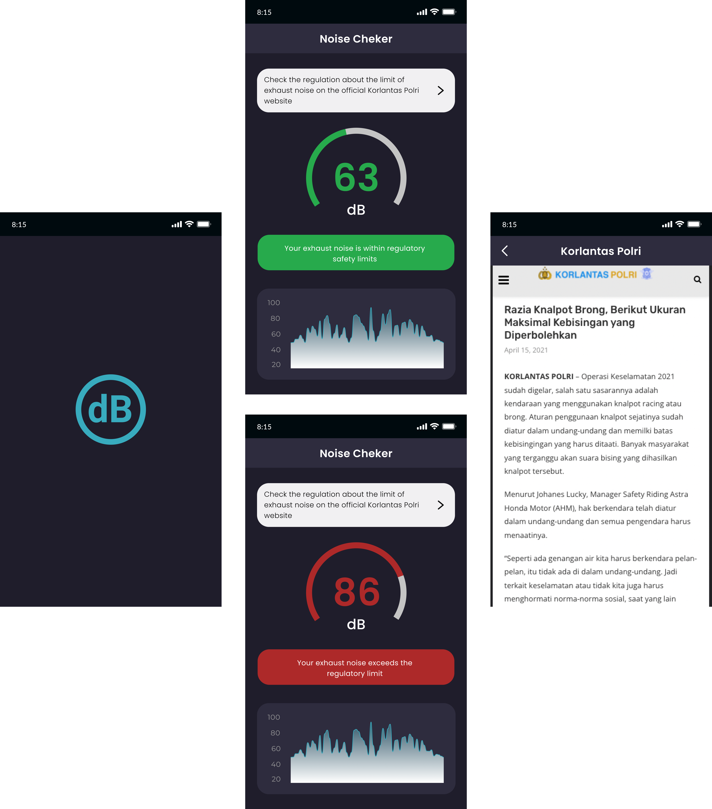
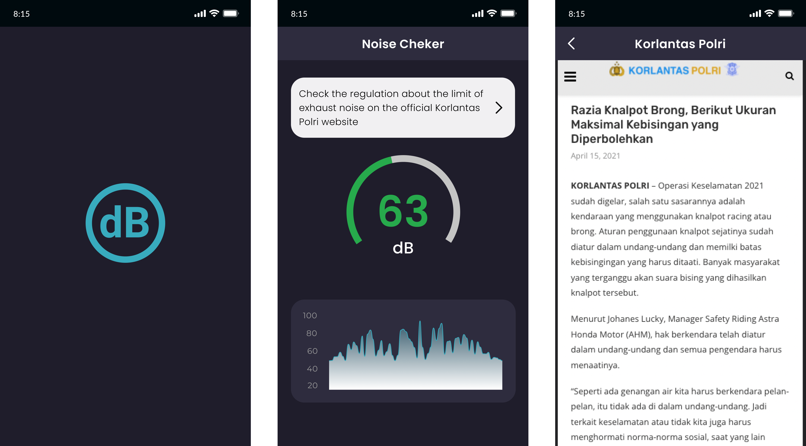

# ExhaustDBChecker

I want to make a noise exhaust detection application, which makes it possible for the user to know the exhaust noise in db units

## Target Segment

- people who want to know if their exhaust noise violates noise regulations in indonesia

## Advance Topics (for Flutter)

- WebView (show the valid website about noise exhaust regulation from korlantas.porli.go.id)

## Features

- User can know their exhaust noise in db
- User get feedback about the exhaust noise 
- User can see valid website about noise exhaust regulation from (https://korlantas.polri.go.id/news/razia-knalpot-brong-berikut-ukuran-maksimal-kebisingan-yang-diperbolehkan/)

## Mockups

### New

### Old

