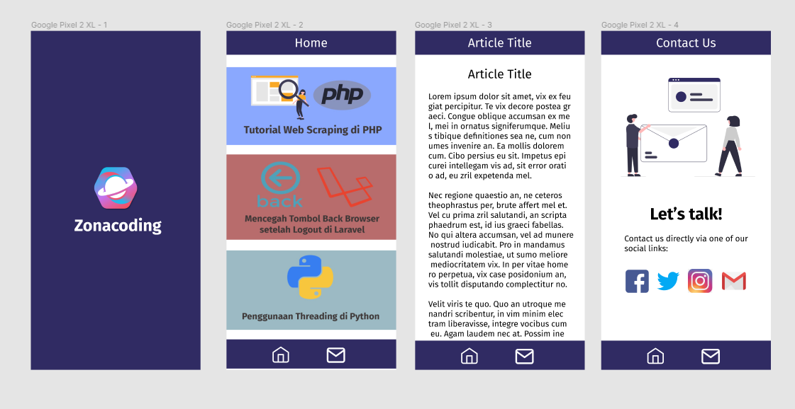

# Zona Coding

Zona Coding is an application that provides free programming tutorial articles in Indonesian

# Target Users

- Users who want to learn programming
- Programmer in general
- <a href="https://zonacoding.com/">Zona Coding</a>'s visitor or <a href="https://www.instagram.com/zonacoding/followers/">followers</a>

# Advanced Topic

- REST API
- WebView

# Features

- Users can see the list of Zona Coding's articles
- Users can see specific article
- Users can comment on the specific article
- Users can contact us using the social links button

# Mockups

# Technology Used

- Android Studio
